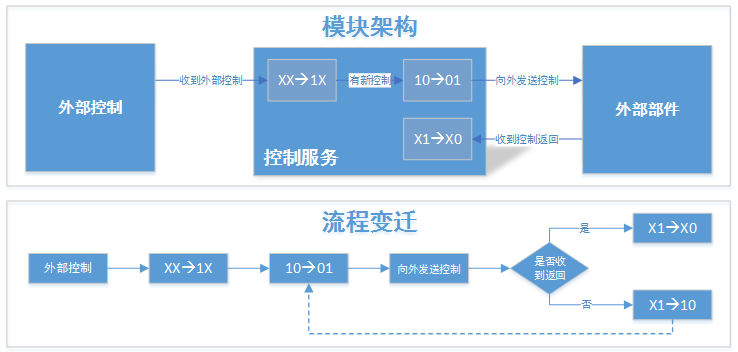
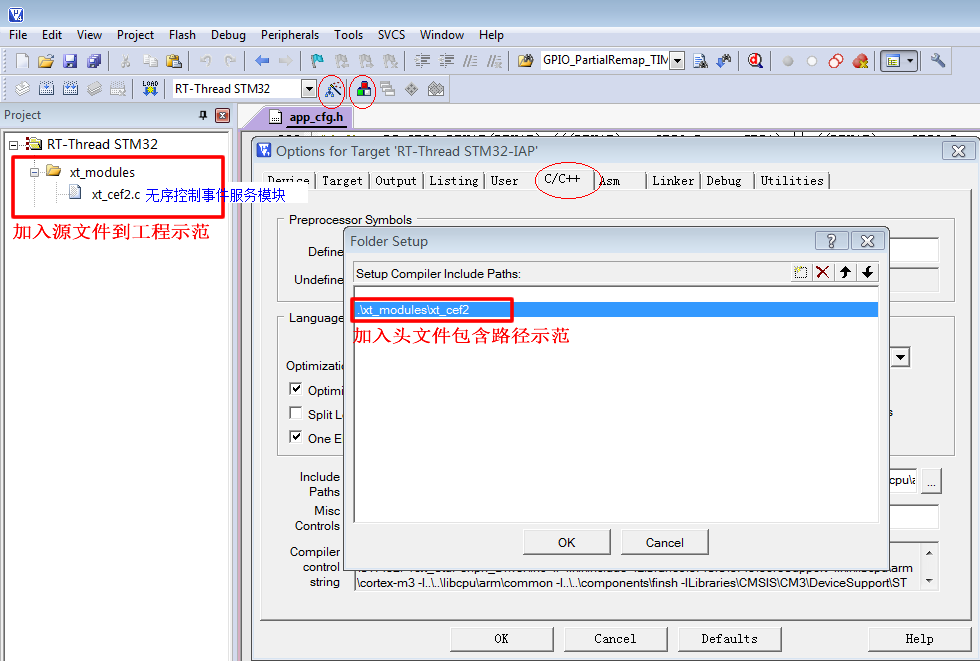
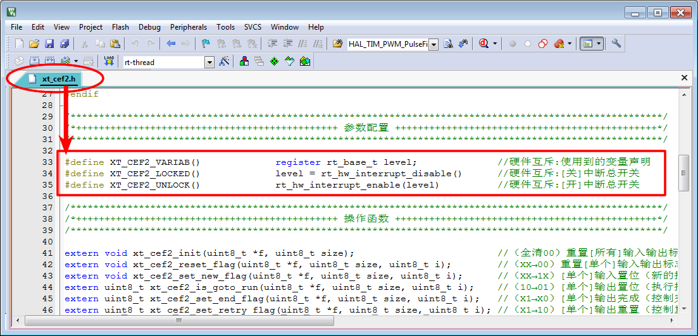

<!-- +++
author = "XT"
comments = false
date  = "2022-12-05"
draft = false
share = false
image = ""
menu  = ""
slug  = ""
title = "无序控制事件服务"
+++ -->

### 一、构架

<details close=""><summary>1、功能简介</summary>

对于一些无序控制事件或者是由应用业务掌控的有序事件，我们只需使用简单的标志位来标记它，协助应用程序完成由生产到消费的过程。例如：智能家居系统对接第三方设备，一款卫浴壁挂炉，它只有开关机、设置温度两种操作，这两条控制指令无时序要求，任何时刻发送过去都可受理。处理方法：使用两位标志位标记，高位标志为新控制事件，低位标志为执行事件，通过两个标志位组合可标记出：新事件、执行、完成等多种状态，根据这些状态配合应用程序完成相关控制的过程。

</details>

<details close=""><summary>2、模块架构</summary>

  

当收到有新控制时：则为`XX→1X`，调用函数`xt_cef2_set_new_flag()`；  
应用去查有新控制：则为`10→01`，实现函数`xt_cef2_is_goto_run()`返回非 0 时执行控制；  
应用收到控制返回：则为`X1→X0`，调用函数`xt_cef2_set_end_flag()`；  

</details>

<details close=""><summary>3、环境要求</summary>

|  环境  |  要求  |
| :----- | :----- |
| 软件环境 | 实时操作系统 或 裸机环境 均可 |
| 硬件环境 | STM8 及更高性能 MCU |

</details>

### 二、移植

<details close=""><summary>1、添加源文件</summary>

将模块源文件、文件包含路径添加到工程，示例：



</details>

<details close=""><summary>2、包含头文件</summary>

在使用模块的应用程序中加入头文件包含，示例：  

```c
#if (XT_APP_CEF2_EN == XT_DEF_ENABLED)
#include "xt_cef2.h"
#endif
```

</details>

<details close=""><summary>3、配置模块参数</summary>

根据实际的使用环境配置模块参数，示例：

  

补充说明：由于标准模块是不允许用户修改的，所以在应用时请启用头文件映射，在映射头文件修改配置！

</details>

<details close=""><summary>4、使能模块开关</summary>

在工程头文件《application.h》统一使能模块开关，示例：

```c
#define XT_DEF_DISABLED                 0                               /* 禁用模块                     */
#define XT_DEF_ENABLED                  1                               /* 使能模块                     */

#define __XT_CEF2_REMAP_H
#ifndef XT_APP_CEF2_EN
#define XT_APP_CEF2_EN                  XT_DEF_ENABLED                  /* 控制事件标志服务模块         */
#endif
```

</details>

### 三、使用

<details close=""><summary>1、应用示例</summary>

本示范只是以最简单方式展示模块的基本使用，并非一个应用实例！

```c
#include <stdint.h>
#include "xt_cef2.h"

  //-------------------------------------------
  
  uint8_t app_cef2[1] = {0}; //事件标志器
  #define APP_CEF2_ONOFF 0   //开关机事件
  #define APP_CEF2_TEMP  1   //设置温度事件 
  #define APP_CEF2_SUM   2   //总数
  
  //-------------------------------------------
  
  //1、当收到有新控制时：则为`XX→1X`，调用函数
  xt_cef2_set_new_flag(app_cef2, sizeof(app_cef2), APP_CEF2_ONOFF);
  
  //-------------------------------------------
  
  //2、应用去查有新控制：则为`10→01`，实现函数
  if (xt_cef2_is_goto_run(app_cef2, sizeof(app_cef2), APP_CEF2_ONOFF) != 0)
  {
    //执行控制……
  }
  
  //-------------------------------------------
  
  //3、应用收到控制返回：则为`X1→X0`，调用函数
  xt_cef2_set_end_flag(app_cef2, sizeof(app_cef2), APP_CEF2_ONOFF);
  
  //3、如果没有收到返回：则为`X1→10`，调用函数
  xt_cef2_set_retry_flag(app_cef2, sizeof(app_cef2), APP_CEF2_ONOFF);
  
  //-------------------------------------------
  //……
```

</details>