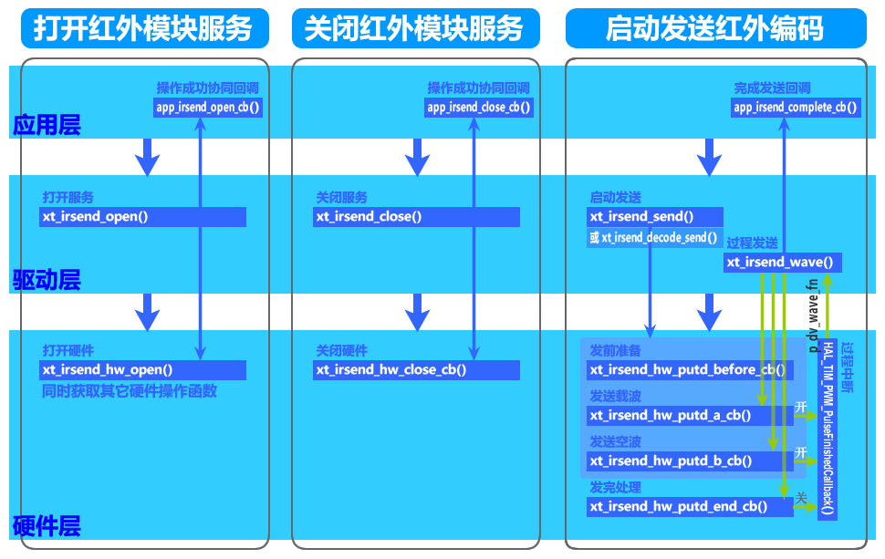
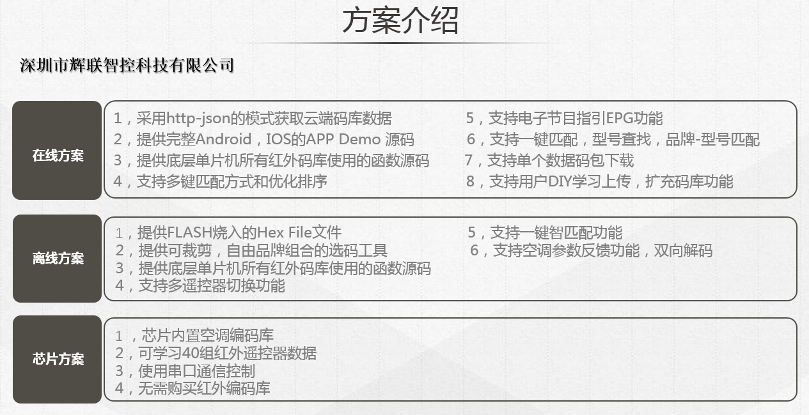
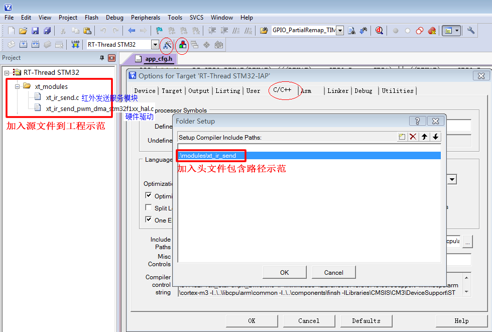
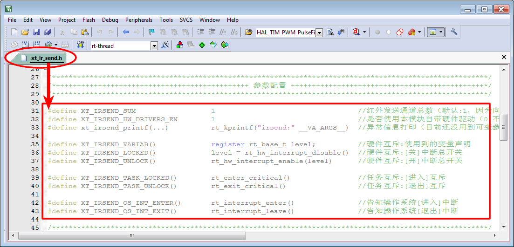

<!-- +++
author = "XT"
comments = false
date  = "2022-11-23"
draft = false
share = false
image = ""
menu  = ""
slug  = ""
title = "红外发送服务模块"
+++ -->

### 一、构架

<details close=""><summary>1、功能简介</summary>

红外发送服务模块是为应用程序发送红外遥控码提供统一、规范的驱动接口。支持任意载波频率发送（30K～56KHz）；支持直接发送时间码（时间码默认格式为：有载波时间、无载波时间、有、无 …）；支持即时解码发送（通过回调接口实现解一个码发一个码）。  

</details>

<details close=""><summary>2、模块架构</summary>



</details>

<details close=""><summary>3、环境要求</summary>

|  环境  |  要求  |
| :----- | :----- |
| 软件环境 | 实时操作系统 或 裸机环境 均可 |
| 硬件环境 | STM32F103 及更高性能 MCU |

<!--
* 已编写【STM32F103 单片机 HAL 库-定时器-PWM + DMA】硬件驱动，  
相关技术细节可参考 [STM32F1/F7使用HAL库DMA方式输出PWM详解](https://blog.csdn.net/qq_30267617/article/details/109466698)、[STM32F1-HAL库踩坑记:DMA+TIM输出比较模式](https://blog.csdn.net/hyh80227/article/details/98483992)、[PWM输出第一个脉冲宽度异常的话题](https://www.stmcu.org.cn/module/forum/forum.php?mod=viewthread&tid=623351)。
* 除了用 DMA 方式，还可以使用输出 PWM + 个数计数方式，相关方法可参考 [STM32如何实现可调频率、占空比的PWM波形，且可指定输出脉冲个数](https://blog.csdn.net/ybhuangfugui/article/details/99826742)。  
* 除了上面两种方法外，最普通的方法是控制 PWM 输出时间，需要用到的硬件资源 TIM-PWM + 定时器。  
-->

</details>

<details close=""><summary>4、红外知识</summary>

4.1、**红外发送编码格式** ： 
红外码发送无非就是发送前半段有载波码，再隔一段时间（可理解为是后半段无载波码），如此循环发送多组码。红外编码大体分两部分：起始 + 数据。其中常用 NEC 协议数据编码：超始 + 地址 + 地址(取反) + 数据 + 数据(取反)。NEC 协议信号编码：超始由 9ms 载波码 + 4.5ms 无载波码组成，数据 bit = 0 由 0.56ms 载波码 + 0.56ms 无载波码组成，数据 bit = 1 由 0.56ms 载波码 + 1.68ms 无载波码组成。根据红外码库方案商提供的信息，无载波码最长有超过 100ms，如果使用两字节表示时间码，则建议使用 4us 作为计时单位。  

4.2、**红外载波频率范围** ： 
一般在 30~56KHz 之间，常用频率为 30KHz、33KHz、36KHz、38KHz、40KHz、56KHz，其中 38KHz 为最常用。其实这个载波频率与晶振及芯片分频有关系，例如某方案：使用的 455KHz 晶振，芯片对晶振进行整数分频，分频系数一般为 12，所以 455kHz÷12≈37.9kHz≈38kHz 的载波频率。  

4.3、**关于载波频率占空比**  
网上有说是 1:1、1:3 之类的，建议还是 1:1 为好，因为这个要与常规接收头适配。  

4.4、**红外码库方案提供商**  
当前有一些手机带有红外遥控功能，它其实就是手机商 APP 从红外码库方案提供商获取红外码，通过手机红外发射头发送出去，实现遥控屋里电器。现在兴起智能家居系统，要实现场景联动，需要控制第三方设备，其中一种方式就是通过红外来控制。例如：典型控制-打开空调控制室内温度。  

<details close=""><summary>4.4.1、深圳市辉联智控科技有限公司</summary>

1. [官网](http://www.hongwaimaku.com/)  

  
  

</details>

<details close=""><summary>4.4.2、青岛酷控网络科技有限公司</summary>

1. [官网](https://www.kookong.com/)  

  

</details>

</details>

### 二、移植

<details close=""><summary>1、添加源文件</summary>

将模块源文件、文件包含路径添加到工程，示例：



</details>

<details close=""><summary>2、加入引脚定义</summary>

在工程头文件《board.h》统一加入引脚定义，示例：

```c
// 红外发送服务+++++++++++++++++++++++
// 配置PWM的频率
#define XT_IRSEND_TIM_DIV            1                                      /* 定时器的时钟分频         */
#define XT_IRSEND_TIM_PWM_HZ(hz)   ((72000000/(XT_IRSEND_TIM_DIV+1)/(hz))-1)/* PWM 100%数值(≤0xFFFF)   */

// 配置PWM的定时器
#define XT_IRSEND_TIM                TIM3                               /* 定时器                       */
#define XT_IRSEND_TIM_CLK_DI()     __HAL_RCC_TIM3_CLK_DISABLE()         /* 定时器时钟禁能               */
#define XT_IRSEND_TIM_CLK_EN()     __HAL_RCC_TIM3_CLK_ENABLE()          /* 定时器时钟使能               //
#define XT_IRSEND_TIM_AFIO_REMAP() __HAL_AFIO_REMAP_TIM3_PARTIAL()      // 定时器引脚重映射(不用则屏蔽) */ //只有 TIM1~5 才有映射 (分为:重映射[TIM4~5]、部分和完全重映射TIM1~3)

// 配置PWM的通道（只使用1路）
#define XT_IRSEND_PWM_CLK_ENABLE() __HAL_RCC_GPIOB_CLK_ENABLE()         /* PWM 管脚时钟使能             */
#define XT_IRSEND_PWM_GPIO           GPIOB                              /* PWM 所在端口                 */
#define XT_IRSEND_PWM_PIN            GPIO_PIN_1                         /* PWM 所在管脚                 */
#define XT_IRSEND_PWM_OCMODE         TIM_OCMODE_PWM1 /*不能改*/         /* PWM 输出极性模式(2则反极性)  */ //使用在:非0%,非停止
#define XT_IRSEND_PWM_OCPOLARITY     TIM_OCPOLARITY_HIGH                /* PWM 有效占空比输出的电平     // //正向通道
#define XT_IRSEND_PWM_OCIDLESTATE    TIM_OCIDLESTATE_RESET              // PWM 空闲时电平(不用则屏蔽)   */ //只针对TIM1,其它定时器默认为低电平
#define XT_IRSEND_PWM_CCR            CCR4                               /* PWM 占空比寄存器(TIM3->CCR4) */
#define XT_IRSEND_PWM_TIM_CHANNEL    TIM_CHANNEL_4                      /* PWM 所在定时器通道           */
#define XT_IRSEND_TIM_DMA_ID_CC      TIM_DMA_ID_CC4                     /* 定时器DMA更新请求通道(如:CC4)*/
#define XT_IRSEND_TIM_DMA_CC         TIM_DMA_CC4                        /* 定时器DMA更新事件通道(如:CC4)*/

// 配置PWM的DMA
#define XT_IRSEND_DMA_CLK_ENABLE() __HAL_RCC_DMA1_CLK_ENABLE()          /* DMA 时钟使能                 */
#define XT_IRSEND_DMA_CHANNEL        DMA1_Channel3                      /* DMA 通道                     */
#define XT_IRSEND_DMA_IRQn           DMA1_Channel3_IRQn                 /* DMA 中断通道                 */
#define XT_IRSEND_DMA_PRE_INT_PRIO   0                                  /* DMA 通道抢占中断优先级       */
#define XT_IRSEND_DMA_SUB_INT_PRIO   0                                  /* DMA 通道响应中断优先级       */
#define XT_IRSEND_DMA_PRIORITY       DMA_PRIORITY_MEDIUM                /* DMA 通道优先级（中等）       */
#define XT_IRSEND_DMA_IRQHandler     DMA1_Channel3_IRQHandler           /* DMA 中断向量函数             */
#define XT_IRSEND_RAM_SUM            65 /*以空间换取执行效率*/          /* DMA 转传数据源大小(数据个数) */

/* 补充：STM32F103 DMA 资源介绍
DMA1_Channel1: ADC1,TIM2_CH3,TIM4_CH1
DMA1_Channel2: SPI1_RX,USART3_TX,TIM1_CH1,TIM2_UP,TIM3_CH3
DMA1_Channel3: SPI1_TX,USART3_RX,TIM1_CH2,TIM3_CH4/TIM3_UP
DMA1_Channel4: SPI/I2S2_RX,USART1_TX,I2C2_TX,TIM1_TX4/TIM1_TRIG/TIM1_COM,TIM4_CH2
DMA1_Channel5: SPI/I2S2_TX,USART1_RX,I2C2_RX,TIM1_UP,TIM2_CH1,TIM4_CH3
DMA1_Channel6: USART2_RX,I2C1_TX,TIM1_CH3,TIM3_CH1/TIM3_TRIG
DMA1_Channel7: USART2_TX,I2C1_RX,TIM2_CH2/TIM2_CH4,TIM4_UP
DMA2_Channel1: SPI/I2S3_RX,TIM5_CH4/TIM5_TRIG,TIM8_CH3/TIM8_UP
DMA2_Channel2: SPI/I2S3_TX,TIM5_CH3/TIM5_UP,TIM8_CH4/TIM8_TRIG,TIM8_COM
DMA2_Channel3: UART4_RX,TIM6_UP/DAC_CH1,TIM8_CH1
DMA2_Channel4: SDIO,TIM5_CH2,TIM7_UP/DAC_CH2
DMA2_Channel5: ADC3,UART4_TX,TIM5_CH1,TIM8_CH2
*/
```  

</details>

<details close=""><summary>3、加入初始函数</summary>

在工程硬件初始化函数中加入模块硬件初始化，示例：

```c
int bsp_board_init(void)
{
	.
	.
	#if (XT_APP_IRSEND_EN == XT_DEF_ENABLED)
	xt_irsend_hw_init();
	#endif
	.
	.
}
```

补充说明：如果工程有自动初始架构，可以由宏`XT_HARD_INIT_2_TAB_EXPORT(func,name)`自动调用函数进行初始化！

</details>

<details close=""><summary>4、包含头文件</summary>

在使用模块的应用程序中加入头文件包含，示例：  

```c
#if (XT_APP_IRSEND_EN == XT_DEF_ENABLED)
#include "xt_ir_send.h"
#endif
```

</details>

<details close=""><summary>5、配置模块参数</summary>

根据实际的使用环境配置模块参数，示例：

  

补充说明：由于标准模块是不允许用户修改的，所以在应用时请启用头文件映射，在映射头文件修改配置！

</details>

<details close=""><summary>6、使能模块开关</summary>

在工程头文件《application.h》统一使能模块开关，示例：

```c
#define XT_DEF_DISABLED                 0                               /* 禁用模块                     */
#define XT_DEF_ENABLED                  1                               /* 使能模块                     */

#define __XT_IR_SEND_REMAP_H
#ifndef XT_APP_IRSEND_EN
#define XT_APP_IRSEND_EN                XT_DEF_ENABLED                  /* 红外遥控发送服务模块         */
#endif
```

</details>

### 三、使用

<details close=""><summary>1、应用示例</summary>

本示范只是以最简单方式展示模块的基本使用，并非一个应用实例！

```c
#include <stdint.h>
#include "rtthread.h"
#include "xt_ir_send.h"

xt_irsend_obj_t app_irsend_obj; //红外发送服务应用对象
uint16_t app_irsend_buf[100];   //红外发送缓冲
uint16_t app_irsend_flag = 0;   //状态

/**
  * @brief  红外发送服务[打开]操作成功协同回调
  * @param  *p_ob      红外发送服务对象
  * @return void
  */
void app_irsend_open_cb(const xt_irsend_obj_t *p_ob)
{
	//注意：上层已处理任务互斥!!
	//XT_IRSEND_TASK_LOCKED(); //>>>>>>>>>>>>>>
	app_irsend_flag = 1; //根据实际通知应用程序...
	//XT_IRSEND_TASK_UNLOCK(); //<<<<<<<<<<<<<<
}

/**
  * @brief  红外发送服务[关闭]操作成功协同回调
  * @param  *p_ob      红外发送服务对象
  * @return void
  */
void app_irsend_close_cb(const xt_irsend_obj_t *p_ob)
{
	//注意：上层已处理任务互斥!!
	//XT_IRSEND_TASK_LOCKED(); //>>>>>>>>>>>>>>
	app_irsend_flag = 0; //根据实际通知应用程序...
	//XT_IRSEND_TASK_UNLOCK(); //<<<<<<<<<<<<<<
}

/**
  * @brief  红外发送刚刚[完成]通知回调
  * @param  *p_ob      红外发送服务对象
  * @return void
  */
void app_irsend_complete_cb(const xt_irsend_obj_t *p_ob)
{
	//注意：在中断中通知!!
	//根据实际通知应用程序...
}

/**
  * @brief  [打开]红外发送服务
  * @param  void
  * @return void
  */
void app_irsend_open(void)
{
	app_irsend_obj.end_us               = 100000;                 //发完1帧红外码后强行插入间隔时间（单位:us）
	app_irsend_obj.ir_khz               = 38;                     //红外载波频率（预设）（单位:KHz）
	app_irsend_obj.ir_num               = 0;                      //红外发送通道编号（＜IRSEND_SUM）
	app_irsend_obj.send_buf_size        = sizeof(app_irsend_buf); //红外发送缓冲大小（单位：字节）
	app_irsend_obj.p_send_buf           = app_irsend_buf;         //红外发送缓冲
	app_irsend_obj.p_irsend_open_fn     = app_irsend_open_cb;     //红外发送服务[打开]操作成功协同回调
	app_irsend_obj.p_irsend_close_fn    = app_irsend_close_cb;    //红外发送服务[关闭]操作成功协同回调
	app_irsend_obj.p_irsend_complete_fn = app_irsend_complete_cb; //红外发送刚刚[完成]通知回调
	app_irsend_obj.p_hw_open_fn         = 0;                      //本应用模块不提供硬件驱动程序
	if (xt_irsend_open(&app_irsend_obj) < 0)
	{
		rt_kprintf("xt_irsend_open return error!\r\n");
	}
}

/**
  * @brief  [关闭]红外发送服务
  * @param  void
  * @return void
  */
void app_irsend_close(void)
{
	if (xt_irsend_close(&app_irsend_obj) < 0)
	{
		rt_kprintf("xt_irsend_close return error!\r\n");
	}
}

/**
  * @brief  [发送]红外码示例
  * @param  void
  * @return void
  */
void app_irsend(void)
{
	uint16_t send_dat[6] = {9000, 4500,  560,  1680,  560,  560}; //单位:us
	
	//直接发送时间码
	if (xt_irsend_send(&app_irsend_obj, send_dat, sizeof(send_dat)/*字节*/, 1/*us*/, 38/*KHz*/) < 0)
	{
		rt_kprintf("xt_irsend_send return error!\r\n");
	}
	
	rt_thread_delay(RT_TICK_PER_SECOND);
	
	//即时解码发送                                           ┌假设 send_dat 为压缩码
	if (xt_irsend_decode_send(&app_irsend_obj, (uint8_t *)send_dat, sizeof(send_dat), app_irdecode/*解码函数*/) < 0)
	{
		rt_kprintf("xt_irsend_decode_send return error!\r\n");
	}
}

/**
  * @brief  [解码函数]示例（即时解码为时间码）
  * @param  *pob_tmp   运算现场状态（大小为:sizeof(((xt_irsend_obj_t *)0)->decode_tmp)字节）
  * @param  *p_code    红外压缩码  （通过算法解码为时间码）
  * @param  *p_step    解码步骤    （0:进来表刚开始/返回则表异常，0xFFFF:返回结束）
  * @return 解码后的数据（数据的[bit0]同时用作是否有载波标志,bit0=1:表示此个数据为有载波时间）
  */
uint16_t app_irdecode(void *pob_tmp, uint16_t *p_code, uint16_t *p_step)
{
	switch (*p_step)
	{	                          //第一次返回[红外时间码单位]和[红外载波频率] ←────────────────┐
		case 0: *p_step += 1;     return ((uint16_t)(1/*us,红外时间码单位*/) << 8) | (38/*KHz,红外载波频率*/); //┘
		case 1: *p_step += 1;     return (9000 | 1); //1.有载波时间码
		case 2: *p_step += 1;     return (4500    ); //2.无载波时间码
		case 3: *p_step += 1;     return (560  | 1); //3.有载波时间码
		case 4: *p_step += 1;     return (1680    ); //4.无载波时间码
		case 5: *p_step += 1;     return (560  | 1); //5.有载波时间码
		case 6: *p_step = 0xFFFF; return (560     ); //6.无载波时间码（本例此处为最后一个红外码）
		default:*p_step = 0;      return (0       ); //异常返回!!!!!!
	}
}
```

</details>
