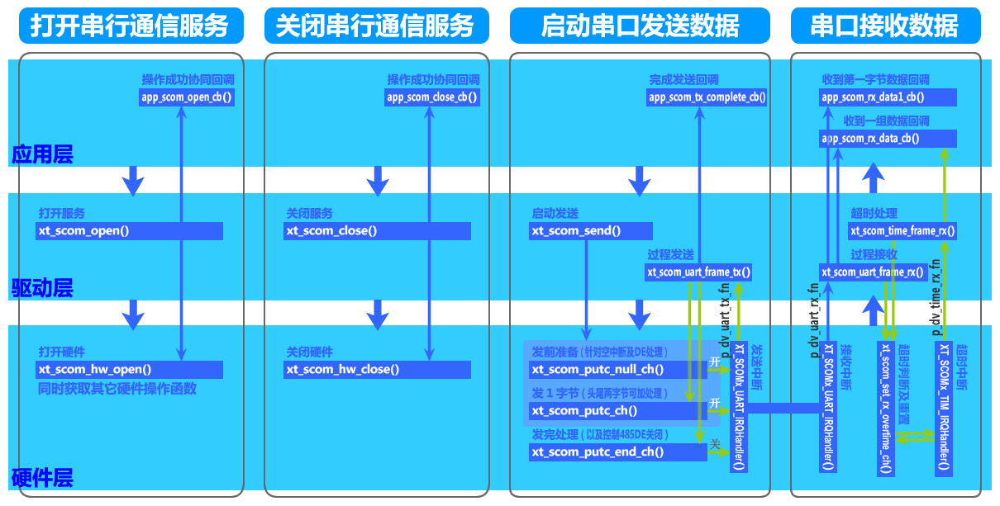
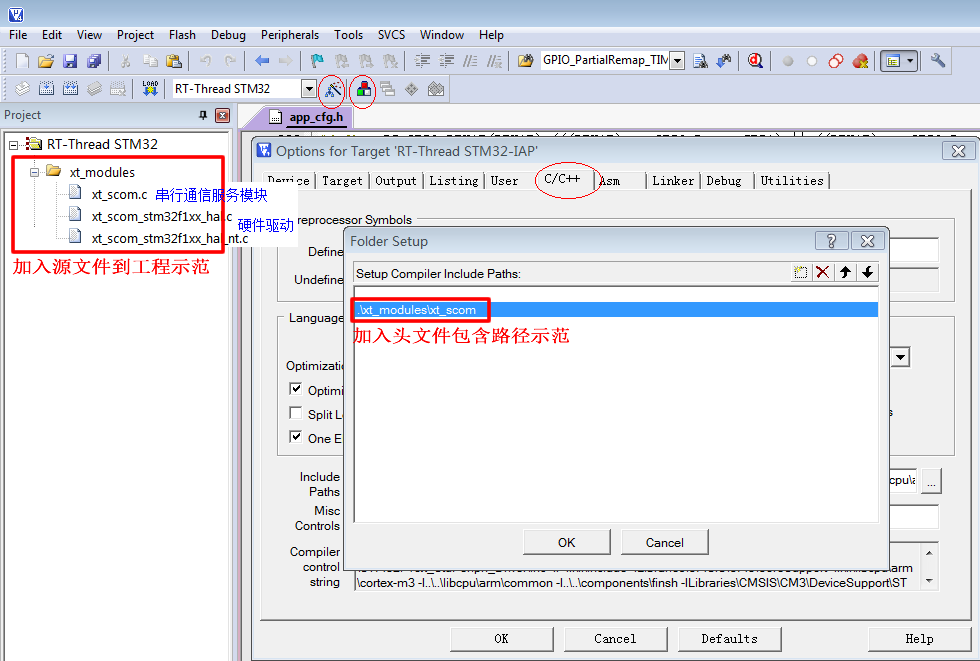
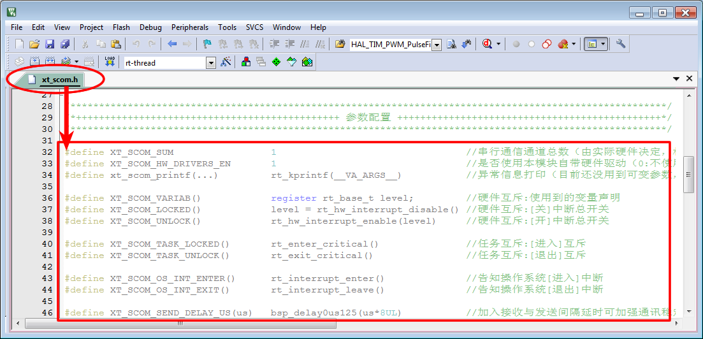

<!-- +++
author = "XT"
comments = false
date  = "2022-11-27"
draft = false
share = false
image = ""
menu  = ""
slug  = ""
title = "串行通信服务模块"
+++ -->

### 一、构架

<details close=""><summary>1、功能简介</summary>

串行通信模块是为应用程序操作串口提供统一、规范的驱动接口。它支持 1～n 个串口通讯（由驱动程序`XT_SCOM_SUM`配置决定），支持绝大部分串口传输协议（数据第 9 bit 作为整帧数据起始标志这种方式目前还不支持），并在接收时已对数据进行初步的分帧（不过应用层还需要进一步判断分帧是否正确）。  

</details>

<details close=""><summary>2、模块架构</summary>



</details>

<details close=""><summary>3、环境要求</summary>

|  环境  |  要求  |
| :----- | :----- |
| 软件环境 | 实时操作系统 或 裸机环境 均可 |
| 硬件环境 | STM8 或 STM32F103 及更高性能 MCU |

</details>

<details close=""><summary>4、协议知识</summary>

串口通讯协议格式一般分为：固定长数据帧、可变长数据帧、纯文本协议三种类型。关于它们的优缺点及设计要点，可参考网文：[PC 机与嵌入式设备通信协议设计的原则](https://blog.csdn.net/jiangjunjie_2005/article/details/50273105)。  

</details>

### 二、移植

<details close=""><summary>1、添加源文件</summary>

将模块源文件、文件包含路径添加到工程，示例：



</details>

<details close=""><summary>2、加入引脚定义</summary>

在工程头文件《board.h》统一加入引脚定义，示例：

```c
// 串行通信服务+++++++++++++++++++++++
// 串行通信模块-定时器（串口+公共定时器）──┐
extern void xt_scomx_tim_irqhandler(void); //├→★★硬件驱动二选一★★ /* 公共定时器中断中每1ms调用1次 */
// 串行通信模块-定时器（串口+独立定时器）──┘
#define XT_SCOMx_TIM                 TIM1                               /* 定时器                       */
#define XT_SCOMx_TIM_CLK_EN()      __HAL_RCC_TIM1_CLK_ENABLE()          /* 定时器时钟使能               */
#define XT_SCOMx_TIM_IRQn            TIM1_CC_IRQn                       /* 定时器中断通道               */
#define XT_SCOMx_TIM_PRE_INT_PRIO    1                                  /* 定时器抢占中断优先级         */
#define XT_SCOMx_TIM_SUB_INT_PRIO    1                                  /* 定时器响应中断优先级         */
#define XT_SCOMx_TIM_CCR1            0xFFFF      /*一般不要改*/         /* 定时器CCR1                   */
#define XT_SCOMx_TIM_CCR2            0xFFFF      /*一般不要改*/         /* 定时器CCR2                   */
#define XT_SCOMx_TIM_CCR3            0xFFFF      /*一般不要改*/         /* 定时器CCR3                   */
#define XT_SCOMx_TIM_CCR4            0xFFFF      /*一般不要改*/         /* 定时器CCR4                   */
#define XT_SCOMx_TIM_TICK_US         1           /*绝对不要改*/         /* 定时器计数节拍(如:1->1us)    */
#define XT_SCOMx_TIM_IRQHandler      TIM1_CC_IRQHandler                 /* 中断向量函数                 */

// 串行通信模块-通道1（☆通道总数由[XT_SCOM_SUM]决定☆）
#define XT_SCOM1_UART                USART1                             /* 使用的哪个串口               */
#define XT_SCOM1_UART_CLK_EN()     __HAL_RCC_USART1_CLK_ENABLE()        /* 串口时钟使能                 */
#define XT_SCOM1_UART_CLK_DI()     __HAL_RCC_USART1_CLK_DISABLE()       /* 串口时钟禁能                 */
#define XT_SCOM1_UART_TX_CLK_EN()  __HAL_RCC_GPIOA_CLK_ENABLE()         /* TX脚时钟使能(不用发送则屏蔽) */
#define XT_SCOM1_UART_RX_CLK_EN()  __HAL_RCC_GPIOA_CLK_ENABLE()         /* RX脚时钟使能(不用接收则屏蔽) */
#define XT_SCOM1_UART_IRQn           USART1_IRQn                        /* 中断通道                     */
#define XT_SCOM1_UART_PRE_INT_PRIO   0                                  /* 抢占中断优先级               */
#define XT_SCOM1_UART_SUB_INT_PRIO   0                                  /* 响应中断优先级               */
#define XT_SCOM1_UART_TX_GPIO        GPIOA                              /* TX 所在端口                  */
#define XT_SCOM1_UART_TX_PIN         GPIO_PIN_9                         /* TX 所在管脚                  */
#define XT_SCOM1_UART_RX_GPIO        GPIOA                              /* RX 所在端口                  */
#define XT_SCOM1_UART_RX_PIN         GPIO_PIN_10                        /* RX 所在管脚                  */
#define XT_SCOM1_UART_RX_IN_MODE     GPIO_PULLUP                        /* RX 输入模式(上拉/悬空)       //
#define XT_SCOM1_UART_AFIO_REMAP() __HAL_AFIO_REMAP_USART1_ENABLE()     // 串口引脚重映射(不使用则屏蔽) // //只有 UART1~3 才有映射
#define XT_SCOM1_DE_CLK_EN()       __HAL_RCC_GPIOA_CLK_ENABLE()         // DE 端口时钟使能(RS485才使能) //
#define XT_SCOM1_DE_GPIO             GPIOA                              // DE 所在端口    (RS485才使能) //
#define XT_SCOM1_DE_PIN              GPIO_PIN_3                         // DE 所在管脚    (RS485才使能) //
#define XT_SCOM1_DE_EN()       XT_SCOM1_DE_GPIO->BSRR = XT_SCOM1_DE_PIN // 使能DE控制端   (RS485才使能) //
#define XT_SCOM1_DE_DI()       XT_SCOM1_DE_GPIO->BRR  = XT_SCOM1_DE_PIN // 禁能DE控制端   (RS485才使能) */
#define XT_SCOM1_UART_IRQHandler     USART1_IRQHandler                  /* 中断向量函数                 */
```  

</details>

<details close=""><summary>3、加入初始函数</summary>

在工程硬件初始化函数中加入模块硬件初始化，示例：

```c
int bsp_board_init(void)
{
	.
	.
	#if (XT_APP_SCOM_EN == XT_DEF_ENABLED)
	xt_scom_hw_init();
	#endif
	.
	.
}
```

补充说明：如果工程有自动初始架构，可以由宏`XT_HARD_INIT_2_TAB_EXPORT(func,name)`自动调用函数进行初始化！

</details>

<details close=""><summary>4、加入超时计数</summary>

在工程硬件定时器中加入模块超时计数处理，示例：

```c
void bsp_tim2_init(void)
{
	.
	.
	// [1ms]中断中循环调用
	// 只针对[串口+公共定时器]硬件驱动程序
	#if (XT_APP_SCOM_EN == XT_DEF_ENABLED)
	#if (XT_SCOM_HW_DRIVERS_EN == 2)
	xt_scomx_tim_irqhandler();
	#endif
	#endif
	.
	.
}
```

</details>

<details close=""><summary>5、包含头文件</summary>

在使用模块的应用程序中加入头文件包含，示例：  

```c
#if (XT_APP_SCOM_EN == XT_DEF_ENABLED)
#include "xt_scom.h"
#endif
```

</details>

<details close=""><summary>6、配置模块参数</summary>

根据实际的使用环境配置模块参数，示例：

  

补充说明：由于标准模块是不允许用户修改的，所以在应用时请启用头文件映射，在映射头文件修改配置！

</details>

<details close=""><summary>7、使能模块开关</summary>

在工程头文件《application.h》统一使能模块开关，示例：

```c
#define XT_DEF_DISABLED                 0                               /* 禁用模块                     */
#define XT_DEF_ENABLED                  1                               /* 使能模块                     */

#define __XT_SCOM_REMAP_H
#ifndef XT_APP_SCOM_EN
#define XT_APP_SCOM_EN                  XT_DEF_ENABLED                  /* 串行通信服务模块             */
#endif
```

</details>

### 三、使用

<details close=""><summary>1、应用示例</summary>

本示范只是以最简单方式展示模块的基本使用，并非一个应用实例！

```c
#include <stdint.h>
#include "xt_scom.h"

xt_scom_obj_t app_scom_obj;  //串行通信服务应用对象
uint8_t app_scom_rx_buf[30]; //串行通信发送缓冲
uint8_t app_scom_tx_buf[30]; //串行通信发送缓冲
uint8_t app_scom_flag = 0;   //状态

void app_scom_open(void);
void app_scom_close(void);
void app_scom_open_cb(const xt_scom_obj_t *p_scom);
void app_scom_close_cb(const xt_scom_obj_t *p_scom);
void app_scom_send(void);
void app_scom_tx_complete_cb(const xt_scom_obj_t *p_scom);
int app_scom_rx_data1_cb(const xt_scom_obj_t *p_scom);
int app_scom_rx_data_cb(const xt_scom_obj_t *p_scom, uint16_t size);

/**
  * @brief  [打开]-串行通信服务
  * @param  void
  * @return void
  */
void app_scom_open(void)
{
	//{起始码    长度 数据      校验和   }
	//{0xFF,0x55,0x02,0x00,0x00,0x01,0x56}
	app_scom_obj.baud_rate        = 9600;                    //【串口属性】：通讯波特率（1200,2400,4800,9600,14400,19200,38400,57600,115200,128000,256000bps等）
	app_scom_obj.stop_bits        = 1;                       //【串口属性】：停止位（1:1位,2:2位）
	app_scom_obj.parity_bits      = 0;                       //【串口属性】：校验位（0:无,1:奇,2:偶）
	app_scom_obj.data_bits        = 8;                       //【串口属性】：数据位（8:8位）
	app_scom_obj.scom_num         = 0;                       //【串口属性】：串行通信通道号（驱动层通道号）（＜XT_SCOM_SUM）
	
	app_scom_obj.section_code[0]  = 0xFF;                    //【协议属性】：〖数据帧〗接收起始码（例如:{0xFF,0x55}）        /〖数据流〗接收结束码（例如:<CR><LF>）
	app_scom_obj.section_code[1]  = 0x55;                    //【协议属性】：〖数据帧〗接收起始码（例如:{0xFF,0x55}）        /〖数据流〗接收结束码（例如:<CR><LF>）
	app_scom_obj.section_mode     = 2;                       //【协议属性】：〖数据帧〗接收起始码大小（0:无,1:1字节,2:2字节）/〖数据流〗接收结束码模式（0:无,1:1字节结束码,2:2字节结束码,3:两字节任一结束码）
	app_scom_obj.len_offset       = 2;                       //【协议属性】：〖数据帧〗接收长度码位置偏移（包含起始码在内整帧位置偏移，例如:5->整帧第6字节，0xFF:无效）
	app_scom_obj.len_arithm       = 5;                       //【协议属性】：〖数据帧〗接收长度码整帧总长算法（5:5+长度码值=整帧总长,0xFF:只能超时分帧）/当{长度码位置偏移=0xFF}时表示接收固定长度
	app_scom_obj.section_us       = 3000;                    //【协议属性】：分帧重置时间（单位:us，0:无效；可用于超时分帧或超时重置接收或接收完成等）
	app_scom_obj.p_rx_buf         = app_scom_rx_buf;         //【协议属性】：接收缓冲（★绝不能为0★）
	app_scom_obj.p_tx_buf         = app_scom_tx_buf;         //【协议属性】：发送缓冲（★绝不能为0★）
	app_scom_obj.rx_buf_size      = sizeof(app_scom_rx_buf); //【协议属性】：接收缓冲大小（0:不支持接收，★及【硬件层】可强制设置为0★）
	app_scom_obj.tx_buf_size      = sizeof(app_scom_tx_buf); //【协议属性】：发送缓冲大小（0:不支持发送，★及【硬件层】可强制设置为0★）
	
	app_scom_obj.p_scom_open_fn   = app_scom_open_cb;        //【应用层服务】：串行通信服务成功打开协同操作函数（常用于设置上层应用标志）
	app_scom_obj.p_scom_close_fn  = app_scom_close_cb;       //【应用层服务】：串行通信服务成功关闭协同操作函数（常用于设置上层应用标志）
	app_scom_obj.p_tx_complete_fn = app_scom_tx_complete_cb; //【应用层服务】：中断中完成发送的通知函数        （内参传递:void）
	app_scom_obj.p_rx_data1_fn    = app_scom_rx_data1_cb;    //【应用层服务】：中断中接收到第一字节数据通知函数（内参传递:pob->p_rx_buf）
	app_scom_obj.p_rx_data_fn     = app_scom_rx_data_cb;     //【应用层服务】：中断中接收到整一组数据的传递函数（内参传递:pob->p_rx_buf, size）
	
	app_scom_obj.p_hw_open_fn     = 0;                       //【硬件层服务】：本应用模块不提供硬件驱动程序
	
	if (xt_scom_open(&app_scom_obj, XT_SCOM_TYPE_DATA_FRAME/*数据帧*/) < 0)
	{
		rt_kprintf("xt_scom_open return error!\r\n");
	}

	/*----------------------------------------------------------------------------------------------------
	//一款蓝牙模块使用AT指令的案例：
	//{"AT#MMbluetooch-name\r\n"}
	app_scom_obj.baud_rate        = 115200;                  //【串口属性】：通讯波特率（1200,2400,4800,9600,14400,19200,38400,57600,115200,128000,256000bps等）
	app_scom_obj.stop_bits        = 1;                       //【串口属性】：停止位（1:1位,2:2位）
	app_scom_obj.parity_bits      = 0;                       //【串口属性】：校验位（0:无,1:奇,2:偶）
	app_scom_obj.data_bits        = 8;                       //【串口属性】：数据位（8:8位）
	app_scom_obj.scom_num         = 0;                       //【串口属性】：串行通信通道号（驱动层通道号）（＜XT_SCOM_SUM）
	
	app_scom_obj.section_code[0]  = '\r';                    //【协议属性】：〖数据流〗接收结束码（例如:<CR><LF>）
	app_scom_obj.section_code[1]  = '\n';                    //【协议属性】：〖数据流〗接收结束码（例如:<CR><LF>）
	app_scom_obj.section_mode     = 2;                       //【协议属性】：〖数据流〗接收结束码模式（0:无,1:1字节结束码,2:2字节结束码,3:两字节任一结束码）
	app_scom_obj.section_us       = 0;                       //【协议属性】：分帧重置时间（单位:us，0:无效；可用于超时分帧或超时重置接收或接收完成等）
	app_scom_obj.p_rx_buf         = app_scom_rx_buf;         //【协议属性】：接收缓冲（★绝不能为0★）
	app_scom_obj.p_tx_buf         = app_scom_tx_buf;         //【协议属性】：发送缓冲（★绝不能为0★）
	app_scom_obj.rx_buf_size      = sizeof(app_scom_rx_buf); //【协议属性】：接收缓冲大小（0:不支持接收，★及【硬件层】可强制设置为0★）
	app_scom_obj.tx_buf_size      = sizeof(app_scom_tx_buf); //【协议属性】：发送缓冲大小（0:不支持发送，★及【硬件层】可强制设置为0★）
	
	app_scom_obj.p_scom_open_fn   = app_scom_open_cb;        //【应用层服务】：串行通信服务成功打开协同操作函数（常用于设置上层应用标志）
	app_scom_obj.p_scom_close_fn  = app_scom_close_cb;       //【应用层服务】：串行通信服务成功关闭协同操作函数（常用于设置上层应用标志）
	app_scom_obj.p_tx_complete_fn = app_scom_tx_complete_cb; //【应用层服务】：中断中完成发送的通知函数        （内参传递:void）
	app_scom_obj.p_rx_data1_fn    = app_scom_rx_data1_cb;    //【应用层服务】：中断中接收到第一字节数据通知函数（内参传递:pob->p_rx_buf）
	app_scom_obj.p_rx_data_fn     = app_scom_rx_data_cb;     //【应用层服务】：中断中接收到整一组数据的传递函数（内参传递:pob->p_rx_buf, size）
	
	app_scom_obj.p_hw_open_fn     = 0;                       //【硬件层服务】：本应用模块不提供硬件驱动程序
	
	if (xt_scom_open(&app_scom_obj, XT_SCOM_TYPE_DATA_STREAM//字符串//) < 0)
	{
		rt_kprintf("xt_scom_open return error!\r\n");
	}
	------------------------------------------------------------------------------------------------------
	//固定长度数据帧案例：
	//{起始码    数据                校验和   }
	//{0xAA,0x55,0x00,0x00,0x00,0x00,0x00,0xFF}
	app_scom_obj.baud_rate        = 9600;                    //【串口属性】：通讯波特率（1200,2400,4800,9600,14400,19200,38400,57600,115200,128000,256000bps等）
	app_scom_obj.stop_bits        = 1;                       //【串口属性】：停止位（1:1位,2:2位）
	app_scom_obj.parity_bits      = 0;                       //【串口属性】：校验位（0:无,1:奇,2:偶）
	app_scom_obj.data_bits        = 8;                       //【串口属性】：数据位（8:8位）
	app_scom_obj.scom_num         = 0;                       //【串口属性】：串行通信通道号（驱动层通道号）（＜XT_SCOM_SUM）
	
	app_scom_obj.section_code[0]  = 0xAA;                    //【协议属性】：〖数据帧〗接收起始码（例如:{0xFF,0x55}）        /〖数据流〗接收结束码（例如:<CR><LF>）
	app_scom_obj.section_code[1]  = 0x55;                    //【协议属性】：〖数据帧〗接收起始码（例如:{0xFF,0x55}）        /〖数据流〗接收结束码（例如:<CR><LF>）
	app_scom_obj.section_mode     = 2;                       //【协议属性】：〖数据帧〗接收起始码大小（0:无,1:1字节,2:2字节）/〖数据流〗接收结束码模式（0:无,1:1字节结束码,2:2字节结束码,3:两字节任一结束码）
	app_scom_obj.len_offset       = 0xFF;                    //【协议属性】：〖数据帧〗接收长度码位置偏移（包含起始码在内整帧位置偏移，例如:5->整帧第6字节，0xFF:无效）
	app_scom_obj.len_arithm       = 8;                       //【协议属性】：〖数据帧〗接收长度码整帧总长算法（5:5+长度码值=整帧总长,0xFF:只能超时分帧）/当{长度码位置偏移=0xFF}时表示接收固定长度
	app_scom_obj.section_us       = 2000;                    //【协议属性】：分帧重置时间（单位:us，0:无效；可用于超时分帧或超时重置接收或接收完成等）
	app_scom_obj.p_rx_buf         = app_scom_rx_buf;         //【协议属性】：接收缓冲（★绝不能为0★）
	app_scom_obj.p_tx_buf         = app_scom_tx_buf;         //【协议属性】：发送缓冲（★绝不能为0★）
	app_scom_obj.rx_buf_size      = sizeof(app_scom_rx_buf); //【协议属性】：接收缓冲大小（0:不支持接收，★及【硬件层】可强制设置为0★）
	app_scom_obj.tx_buf_size      = sizeof(app_scom_tx_buf); //【协议属性】：发送缓冲大小（0:不支持发送，★及【硬件层】可强制设置为0★）
	
	app_scom_obj.p_scom_open_fn   = app_scom_open_cb;        //【应用层服务】：串行通信服务成功打开协同操作函数（常用于设置上层应用标志）
	app_scom_obj.p_scom_close_fn  = app_scom_close_cb;       //【应用层服务】：串行通信服务成功关闭协同操作函数（常用于设置上层应用标志）
	app_scom_obj.p_tx_complete_fn = app_scom_tx_complete_cb; //【应用层服务】：中断中完成发送的通知函数        （内参传递:void）
	app_scom_obj.p_rx_data1_fn    = app_scom_rx_data1_cb;    //【应用层服务】：中断中接收到第一字节数据通知函数（内参传递:pob->p_rx_buf）
	app_scom_obj.p_rx_data_fn     = app_scom_rx_data_cb;     //【应用层服务】：中断中接收到整一组数据的传递函数（内参传递:pob->p_rx_buf, size）
	
	app_scom_obj.p_hw_open_fn     = 0;                       //【硬件层服务】：本应用模块不提供硬件驱动程序
	
	if (xt_scom_open(&app_scom_obj, XT_SCOM_TYPE_DATA_FRAME//数据帧//) < 0)
	{
		rt_kprintf("xt_scom_open return error!\r\n");
	}
	----------------------------------------------------------------------------------------------------*/
}

/**
  * @brief  [关闭]-串行通信服务
  * @param  void
  * @return void
  */
void app_scom_close(void)
{
	if (xt_scom_close(&app_scom_obj) < 0)
	{
		rt_kprintf("xt_scom_close return error!\r\n");
	}
}

/**
  * @brief  串行通信服务[打开]操作成功协同回调
  * @param  *p_scom          指向SCOM对象
  * @return void
  */
void app_scom_open_cb(const xt_scom_obj_t *p_scom)
{
	//注意：上层已处理任务互斥!!
	//XT_SCOM_TASK_LOCKED(); //>>>>>>>>>>>>>>>
	app_scom_flag = 1; //根据实际通知应用程序...
	//XT_SCOM_TASK_UNLOCK(); //<<<<<<<<<<<<<<<
}

/**
  * @brief  串行通信服务[关闭]操作成功协同回调
  * @param  *p_scom          指向SCOM对象
  * @return void
  */
void app_scom_close_cb(const xt_scom_obj_t *p_scom)
{
	//注意：上层已处理任务互斥!!
	//XT_SCOM_TASK_LOCKED(); //>>>>>>>>>>>>>>>
	app_scom_flag = 0; //根据实际通知应用程序...
	//XT_SCOM_TASK_UNLOCK(); //<<<<<<<<<<<<<<<
}

/**
  * @brief  [发送]-数据示例
  * @param  void
  * @return void
  */
void app_scom_send(void)
{   //	                  {起始码    长度 数据                     校验     }
    uint16_t send_dat[] = {0xFF,0x55,0x05,0x01,0x02,0x03,0x04,0x05,0x01,0x68};
    if (xt_scom_send(&app_scom_obj, send_dat, sizeof(send_dat)/*字节*/, 0/*us*/) < 0)
    {
        rt_kprintf("xt_scom_send return error!\r\n");
    }
}

/**
  * @brief  [通知]-完成发送数据（在中断中回调）
  * @param  *p_scom          指向SCOM对象
  * @return void
  */
void app_scom_tx_complete_cb(const xt_scom_obj_t *p_scom)
{
	//注意：在中断中通知!!
	//根据实际通知应用程序...
}

/**
  * @brief  [通知]-收到第1字节数据（在中断中回调）
  * @param  *p_scom          指向SCOM对象
  * @param  p_scom->p_rx_buf 数据缓冲
  * @return 清除此字节数据（0:清除此字节数据,其它:不清除）
  */
int app_scom_rx_data1_cb(const xt_scom_obj_t *p_scom)
{
	//例如：AT指令，可利用本函数判断起始字符
	//return (p_scom->p_rx_buf[0] != 'A') ? 0 : 0xFFFF;
	//例如：驱动层不缓存数据，而是直接传给应用层
	//rt_mq_send(&mq, p_scom->p_rx_buf, 1);
	//return 0;
	return 0xFFFF;
}

/**
  * @brief  [接收]-接收到一串数据（在中断中回调）
  * @param  *p_scom          指向SCOM对象
  * @param  p_scom->p_rx_buf 数据缓冲
  * @param  size             收到数据大小
  * @return 已处理数据（≥size:已处理全部数据,建议用0xFFFF表示）
  */
int app_scom_rx_data_cb(const xt_scom_obj_t *p_scom, uint16_t size)
{
	//根据实际把数据转传给应用程序!!!!!!!!!!!!!!!!!!!!!!!!!!!!!!!!!!
	//驱动层已初步将数据分帧,不过应用层还需要进一步判断分帧是否正确!
	//如果MODBUS这类协议通过两字节间隔时间来分帧,要判断是否成功分帧：if (p_scom->rx_tim_flag >= 2)
	return 0xFFFF;
}
```

</details>