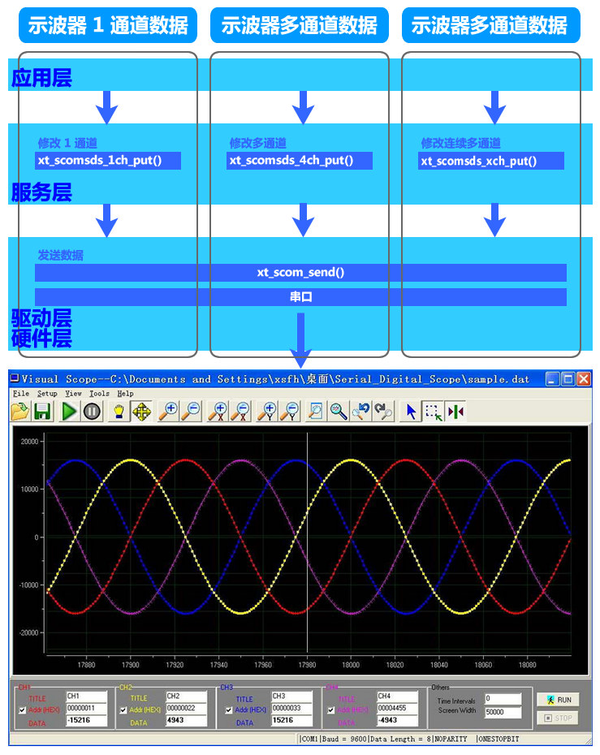

<!-- +++
author = "XT"
comments = false
date  = "2022-12-01"
draft = false
share = false
image = ""
menu  = ""
slug  = ""
title = "Visual Scope 串口虚拟数字示波器"
+++ -->

### 一、构架

<details close=""><summary>1、功能简介</summary>

串口虚拟数字示波器模块为我们将数据通过串口传输到 PC 软件上，并以示波曲线方式显示出来，方便我们对数据的分析，提高调试效率。它提供两种操作接口：修改一路、多路通道，并发送所有通道状态。

</details>

<details close=""><summary>2、模块架构</summary>



</details>

<details close=""><summary>3、环境要求</summary>

|  环境  |  要求  |
| :----- | :----- |
| 软件环境 | 实时操作系统 或 裸机环境 均可 |
| 硬件环境 | STM8 或 STM32F103 及更高性能 MCU |
| 依赖环境 | 依赖【xt_scom】串行通信服务模块 |

</details>

<details close=""><summary>4、软件简介</summary>

我们做项目时，往往需要查看数据曲线。例如：查看单片机使用率的曲线、查看 AD 读出温度值的曲线、查看电机转速的曲线…… 那么有没有像示波器一样显示曲线图的工具呢？当然是有的，今天为大家介绍一款串口虚拟示波器软件 Visual Scope（Serial Digital Scope）。Visual Scope 串口虚拟示波器是一个电脑软件，它将通过串口传输给电脑的数据以示波曲线方式显示出来，方便我们对数据分析，是您必不可缺的开发助手。Visual Scope 支持 4 通道的波形显示，支持 X、Y 轴任意缩放及移动，支持打开与保存波形数据的 Matlab 分析文件，支持 check sum 和 CRC16 两种数据校验方式。

© 本段介绍摘自《一春又一春》博文 © 

</details>

### 二、移植

<details close=""><summary>1、添加源文件</summary>

将模块源文件、文件包含路径添加到工程，示例：


</details>

<details close=""><summary>2、加入初始函数</summary>

在应用初始化函数中加入模块初始化，示例：

```c
void rt_init_thread_entry(void *p_arg)
{
	.
	.
	#if (XT_APP_SCOMSDS_EN == XT_DEF_ENABLED)
	xt_scomsds_init();
	#endif
	.
	.
}
```

补充说明：如果工程有自动初始架构，可以由宏`XT_MSG_INIT_2_TAB_EXPORT(func,name)`自动调用函数进行初始化！

</details>

<details close=""><summary>3、包含头文件</summary>

在使用模块的应用程序中加入头文件包含，示例：  

```c
#if (XT_APP_SCOMSDS_EN == XT_DEF_ENABLED)
#include "xt_scom_sds.h"
#endif
```

</details>

<details close=""><summary>4、配置模块参数</summary>

根据实际的使用环境配置模块参数，示例：

  

补充说明：由于标准模块是不允许用户修改的，所以在应用时请启用头文件映射，在映射头文件修改配置！

</details>

<details close=""><summary>5、使能模块开关</summary>

在工程头文件《application.h》统一使能模块开关，示例：

```c
#define XT_DEF_DISABLED                 0                               /* 禁用模块                     */
#define XT_DEF_ENABLED                  1                               /* 使能模块                     */

#define XT_APP_DEBUG                    20221201                        /* 开启演示                     */
#define __XT_SCOM_SDS_REMAP_H
#ifndef XT_APP_SCOMSDS_EN
#define XT_APP_SCOMSDS_EN               XT_DEF_ENABLED                  /* 串口虚拟数字示波器(VScope)   */
#endif
#define __XT_SCOM_REMAP_H
#ifndef XT_APP_SCOM_EN
#define XT_APP_SCOM_EN                  XT_DEF_ENABLED                  /* 串行通信服务模块             */
#endif
```

</details>

<details close=""><summary>6、依赖模块说明</summary>

本模块依赖于串行通信服务模块【xt_scom】，关于模块移植请参考其说明文档！

</details>

### 三、使用

<details close=""><summary>1、应用示例</summary>

本示范只是以最简单方式展示模块的基本使用，并非一个应用实例！

```c
#include "xt_scom_sds.h"

//直接在应用中调用函数发送，例如显示 CPU 占有率：
xt_scomsds_1ch_put(0x80, (signed short)(cpu10000_usage_get(1)));

//应用示例[1]：单独修改 CH1 并将所有通道数据以【阻塞】方式发送到虚拟示波器显示
xt_scomsds_1ch_put(0, 100);

//应用示例[2]：单独修改 CH1 并将所有通道数据以【非阻塞】方式发送到虚拟示波器显示
xt_scomsds_1ch_put(0x80, 100);

//应用示例[3]：同时修改 CH1、CH3 并将所有通道数据以【阻塞】方式发送到虚拟示波器显示
xt_scomsds_4ch_put(0x01|0x04, 100, 0, -100, 0);

//应用示例[4]：同时修改 CH1、CH3 并将所有通道数据以【非阻塞】方式发送到虚拟示波器显示
xt_scomsds_4ch_put(0x80|0x01|0x04, 100, 0, -100, 0);

```

</details>