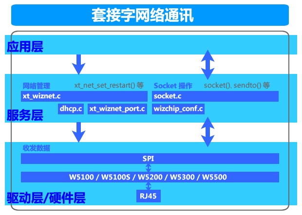
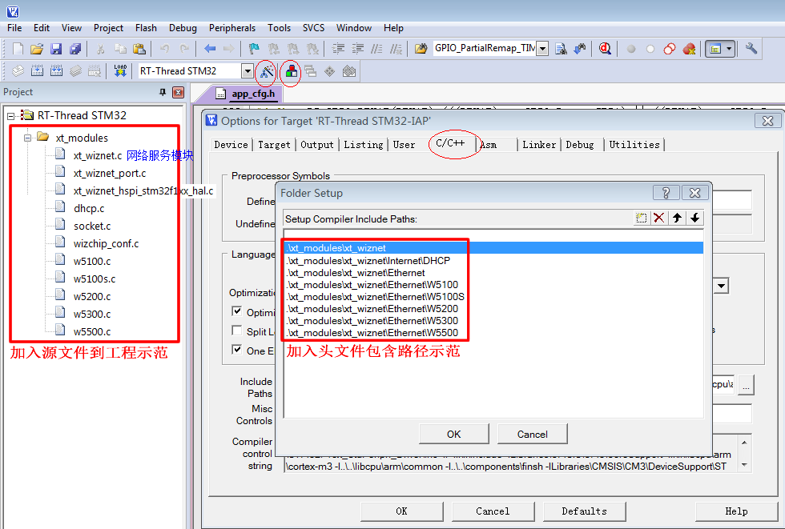
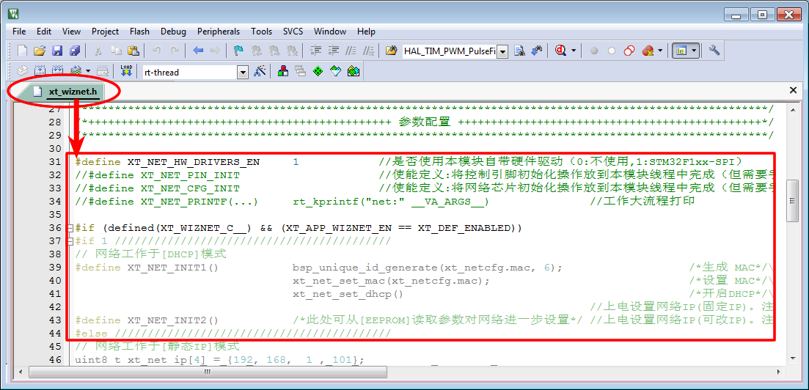
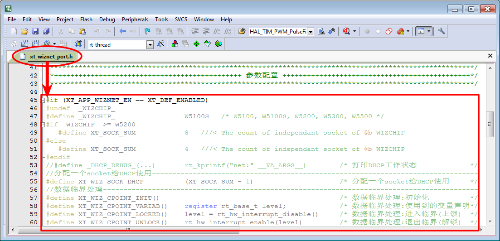

<!-- +++
author = "XT"
comments = false
date  = "2022-12-10"
draft = false
share = false
image = ""
menu  = ""
slug  = ""
title = "网络服务模块（硬件网络栈）"
+++ -->

### 一、构架

<details close=""><summary>1、功能简介</summary>

* WIZnet 为我们提供全硬件 TCP/IP 嵌入式以太网控制器，为嵌入式系统提供了更加简易的互联网连接方案。其集成了 TCP/IP 协议栈，10/100M 以太网数据链路层(MAC)及物理层(PHY)，使得用户使用单芯片就能够在他们的应用中拓展网络连接。用户可以同时使用 4 或 8 个硬件 Socket 独立通讯。提供 SPI 接口,从而能够更加容易与主控 MCU 整合。使用高效 SPI 协议支持 80MHz 速率，从而能够更好的实现高速网络通讯。  
主要特点：  
1. 支持硬件 TCP/IP 协议：TCP, UDP, ICMP, IPv4, ARP, IGMP, PPPoE  
2. 支持 4 或 8 个独立端口（Socket）同时通讯  
3. 支持掉电模式  
4. 支持网络唤醒  
5. 支持高速串行外设接口（SPI 模式 0，3）  
6. 内部 8K 或 32K 字节收发缓存  
7. 内嵌 10BaseT/100BaseTX 以太网物理层（PHY）  
8. 支持自动协商（10/100-Based 全双工/半双工）  
9. 不支持 IP 分片  
10. 3.3V 工作电压，I/O 信号口 5V 耐压；  
11. LED 状态显示（全双工/半双工，网络连接，网络速度，活动状态）；  

</details>

<details close=""><summary>2、模块架构</summary>



</details>

<details close=""><summary>3、环境要求</summary>

|  环境  |  要求  |
| :----- | :----- |
| 软件环境 | 实时操作系统 |
| 硬件环境 | STM32F103 及更高性能 MCU |

</details>

<details close=""><summary>4、厂家代码</summary>

关于厂家代码，由于《socket.c》套接字操作大量使用了`whil()`死循环，不适合系统操作，所以对《socket.c》和《dhcp.c》修改并增加适配操作系统代码！

</details>

### 二、移植

<details close=""><summary>1、添加源文件</summary>

将模块源文件、文件包含路径添加到工程，示例：



</details>

<details close=""><summary>2、加入引脚定义</summary>

在工程头文件《board.h》统一加入引脚定义，示例：

```c
// 网络服务模块+++++++++++++++++++++++
// WIZnet网络芯片SPI总线控制延时
#define XT_WIZ_SPI_NSS_EN_HOLD_TM()                                     /* NSS 使能时保持时间(可不延时) */
#define XT_WIZ_SPI_NSS_DI_HOLD_TM()  bsp_delay0us125(2)                 /* NSS 禁止时保持时间(延时50nS) */

// WIZnet网络芯片控制管脚的定义
#define XT_WIZ_SPI                   SPI2                               /* 使用的哪个SPI                */
#define XT_WIZ_SPI_BAUD_RATE         SPI_BAUDRATEPRESCALER_4            /* 速度(分频): 72/4=18Mbit/S    */
#define XT_WIZ_SPI_CLK_ENABLE()    __HAL_RCC_SPI2_CLK_ENABLE()          /* 串口时钟使能                 */
#define XT_WIZ_SPI_CMS_CLK_EN()    __HAL_RCC_GPIOB_CLK_ENABLE()         /* SCK-MOSI-MISO 脚时钟使能     */
#define XT_WIZ_SPI_NSS_CLK_EN()    __HAL_RCC_GPIOB_CLK_ENABLE()         /* NSS  脚时钟使能              */
#define XT_WIZ_SPI_NSS_GPIO          GPIOB                              /* NSS  所在端口(NSS由软件控制) */
#define XT_WIZ_SPI_NSS_PIN           GPIO_PIN_12                        /* NSS  所在管脚(NSS由软件控制) */
#define XT_WIZ_SPI_SCK_GPIO          GPIOB                              /* SCK  所在端口                */
#define XT_WIZ_SPI_SCK_PIN           GPIO_PIN_13                        /* SCK  所在管脚                */
#define XT_WIZ_SPI_MISO_GPIO         GPIOB                              /* MISO 所在端口                */
#define XT_WIZ_SPI_MISO_PIN          GPIO_PIN_14                        /* MISO 所在管脚                */
#define XT_WIZ_SPI_MOSI_GPIO         GPIOB                              /* MOSI 所在端口                */
#define XT_WIZ_SPI_MOSI_PIN          GPIO_PIN_15                        /* MOSI 所在管脚                */
#define XT_WIZ_SPI_RX_IN_MODE        GPIO_NOPULL                        /* MISO 输入模式(下拉/上拉/悬空)*/
#define XT_WIZ_SPI_DIRECTION_LINES   SPI_DIRECTION_2LINES               /* 收发使用几线(全双工/半双工)  //
#define XT_WIZ_SPI_AFIO_REMAP()    __HAL_AFIO_REMAP_SPI1_ENABLE()       // SPI  引脚重映射(不使用则屏蔽)*/
#define XT_WIZ_SPI_HANDLER           xt_wiz_hspi                        /* SPI  句柄                    */
#define XT_WIZ_RST_CLK_ENABLE()    __HAL_RCC_GPIOA_CLK_ENABLE()         /* RST  所在外设(使能外设时钟)  */
#define XT_WIZ_RST_GPIO              GPIOA                              /* RST  所在端口                */
#define XT_WIZ_RST_PIN               GPIO_PIN_1                         /* RST  所在管脚                */
#define XT_WIZ_RST_EN()              XT_WIZ_RST_GPIO->BRR      = XT_WIZ_RST_PIN     // RST有效
#define XT_WIZ_RST_DI()              XT_WIZ_RST_GPIO->BSRR     = XT_WIZ_RST_PIN     // RST无效
#define XT_WIZ_SPI_NSS_EN()          XT_WIZ_SPI_NSS_GPIO->BRR  = XT_WIZ_SPI_NSS_PIN // NSS有效
#define XT_WIZ_SPI_NSS_DI()          XT_WIZ_SPI_NSS_GPIO->BSRR = XT_WIZ_SPI_NSS_PIN // NSS无效
```

</details>

<details close=""><summary>3、加入初始函数</summary>

在应用初始化函数中加入模块初始化，示例：

```c
int bsp_board_init(void)
{
	.
	.
	#if (XT_APP_WIZNET_EN == XT_DEF_ENABLED)
	xt_net_pin_init();
	#endif
	.
	.
	#if (XT_APP_WIZNET_EN == XT_DEF_ENABLED)
	xt_net_cfg_init();
	#endif
	.
	.
}
```

```c
void rt_init_thread_entry(void *p_arg)
{
	.
	.
	#if (XT_APP_WIZNET_EN == XT_DEF_ENABLED)
	xt_net_ipc_init();
	#endif
	.
	.
	#if (XT_APP_WIZNET_EN == XT_DEF_ENABLED)
	xt_net_thread_init();
	#endif
	.
	.
}
```

补充说明：如果工程有自动初始架构，可以由宏`XT_HARD_INIT_2_TAB_EXPORT(func,name)`、`XT_DEV_INIT_2_TAB_EXPORT(func,name)`、`XT_MSG_INIT_2_TAB_EXPORT(func,name)`、`XT_APP_INIT_2_TAB_EXPORT(func,name)`自动调用函数进行初始化！

</details>

<details close=""><summary>4、包含头文件</summary>

在使用模块的应用程序中加入头文件包含，示例：  

```c
#if (XT_APP_WIZNET_EN == XT_DEF_ENABLED)
#include "xt_wiznet.h"
#endif
```

</details>

<details close=""><summary>5、配置模块参数</summary>

根据实际的使用环境配置模块参数，示例：

  
  

补充说明：由于标准模块是不允许用户修改的，所以在应用时请启用头文件映射，在映射头文件修改配置！

</details>

<details close=""><summary>6、使能模块开关</summary>

在工程头文件《application.h》统一使能模块开关，示例：

```c
#define XT_DEF_DISABLED                 0                               /* 禁用模块                     */
#define XT_DEF_ENABLED                  1                               /* 使能模块                     */

#define __XT_WIZNET_REMAP_H
#define __XT_WIZNET_PORT_REMAP_H
#ifndef XT_APP_WIZNET_EN
#define XT_APP_WIZNET_EN                XT_DEF_ENABLED                  /* 网络服务模块                 */
#endif
```

</details>

### 三、使用

<details close=""><summary>1、应用示例</summary>

本示范只是以最简单方式展示模块的基本使用，并非一个应用实例！

```c
#include "xt_wiznet.h"

// UDP 演示
void app_udp_thread_entry(void *p_arg)
{
    unsigned char *pbuf;
    uint16_t    wkver, lkver;
    uint16_t    len, port;    //端口
    uint8_t     ip[4];        //IP地址
    #define UDP_SK_NUM   0    //使用第几个socket,0~7
    #define UDP_SK_BUFSZ 10   //缓冲大小
    
    while (0 == (pbuf = rt_malloc(UDP_SK_BUFSZ)))
    {
        rt_thread_delay(1);
    }
    udp_socket:
    while (((wkver = xt_net_get_rstver()) & 0x8000) == 0)    //等待网络初始化完成
    {
        rt_thread_delay(1);
    }
    rt_thread_delay(100);
    rt_kprintf("socket 0: net restart!\r\n");
    udp_link:
    while (((lkver = xt_net_get_lnkver()) & 0x8000) == 0)    //等待插上网线
    {
        rt_thread_delay(1);
    }
    rt_kprintf("socket 0: net link up!\r\n");
    udp_build:
    socket(UDP_SK_NUM, Sn_MR_UDP, 1001, 0);                  //打开socket（UDP协议,本机端口:1001）
    rt_kprintf("socket 0: open!\r\n");
    while (1)
    {                                                        //如果socket异常,则...
        if (xt_socket_chk(UDP_SK_NUM, Sn_MR_UDP, 0) == 0) goto udp_build; 
        if (wkver != xt_net_get_rstver()) goto udp_socket;   //如果网络重启了,则...
        if (lkver != xt_net_get_lnkver()) goto udp_link;     //如果网线拔掉了,则...
        xt_socket_ot_set(UDP_SK_NUM, 0xFFFFFFFF/*永久*/, 0); //修改本次socket超时操作为永远
        len = xt_socket_recv_chk(UDP_SK_NUM);                //检测socket是否收到数据
        len = len > UDP_SK_BUFSZ ? UDP_SK_BUFSZ : len;       //处理数据大小与缓冲大小关系
        len = recvfrom(UDP_SK_NUM, pbuf, len, ip, &port);    //socket接收数据（同时得到对端的IP及端口）
        xt_socket_ot_set(UDP_SK_NUM, 50, 0);                 //修改本次socket超时操作为50个系统节拍
        if (sendto(UDP_SK_NUM, pbuf, len, ip, port) != len)  //socket发送数据（把收到的数据返回给对端）
        {                                                    //UDP为无连接,socket发送可随时向目标发送
            rt_kprintf("socket 0: sendto return error!\r\n");
        }
        else
        {
            pbuf[0] = '\r'; //回车
            pbuf[1] = '\n'; //换行
            sendto(UDP_SK_NUM, pbuf, 2, ip, port);
        }
    }
}
```

```c
#include "xt_wiznet.h"

// TCP 客户端演示
void app_tcp_thread_entry(void *p_arg)
{
    unsigned char *pbuf;
    uint16_t    wkver, lkver, cnt;   
    uint16_t    rlen,  tlen,  port = 1002;  //对端端口!!!!!!
    uint8_t     ip[4] = {192, 168, 3, 222}; //对端IP地址!!!!
    uint8_t     t = 1;       //自动维持TCP连接(@5秒)
    #define TCP_SK_NUM   1   //使用第几个socket,0~7
    #define TCP_SK_BUFSZ 100 //缓冲大小
    
    while (0 == (pbuf = rt_malloc(TCP_SK_BUFSZ)))
    {
        rt_thread_delay(1);
    }
    tcp_socket:
    while (((wkver = xt_net_get_rstver()) & 0x8000) == 0)    //等待网络初始化完成
    {
        rt_thread_delay(1);
    }
    rt_thread_delay(300);
    rt_kprintf("socket 1: net restart!\r\n");
    tcp_link:
    while (((lkver = xt_net_get_lnkver()) & 0x8000) == 0)    //等待插上网线
    {
        rt_thread_delay(1);
    }
    rt_kprintf("socket 1: net link up!\r\n");
    while (1)
    {
        tcp_build:
        setsockopt(TCP_SK_NUM, SO_KEEPALIVEAUTO, &t);        //打开TCP连接自动维持(@5秒)(keepalive帧)
        do
        {
           if (wkver != xt_net_get_rstver()) goto tcp_socket;//如果网络重启了,则...
           if (lkver != xt_net_get_lnkver()) goto tcp_link;  //如果网线拔掉了,则...
           rt_thread_delay(2);
           
           socket(TCP_SK_NUM, Sn_MR_TCP, 1002, Sn_MR_ND);    //打开socket（TCP协议,本机端口:1002）
        }
        while (connect(TCP_SK_NUM, ip, port) <= 0);          //连接TCP服务端
        rt_kprintf("socket 1: open and connected!\r\n");
        
        //setsockopt(TCP_SK_NUM, SO_KEEPALIVESEND, 0);       //如果没有打开TCP连接自动维持,则要求应用定时发送维持帧
        tlen = sizeof("tcp client send data!") - 1;
        memcpy(pbuf,  "tcp client send data!", tlen);
        if (send(TCP_SK_NUM, pbuf, tlen) != tlen)            //socket发送数据
        {
            rt_kprintf("socket 1: send len error!\r\n");
			disconnect(TCP_SK_NUM);                          //断开TCP连接
			close(TCP_SK_NUM);                               //关闭socket
            goto tcp_build;
        }
        for (cnt = 0; cnt < tlen; cnt += rlen)               //socket接收数据
        {
            xt_socket_ot_set(TCP_SK_NUM, 100/*1秒*/, 0);     //修改本次socket超时操作为1秒
            rlen = xt_socket_recv_chk(TCP_SK_NUM);           //检测socket是否收到数据
            rlen = rlen > TCP_SK_BUFSZ ? TCP_SK_BUFSZ : rlen;//处理数据大小与缓冲大小关系
            rlen = recv(TCP_SK_NUM, pbuf, rlen);             //socket接收数据（要求服务端返回客户端发送数据）
            //break;
        }
                                                             //如果socket异常,则...
        if (xt_socket_chk(TCP_SK_NUM, Sn_MR_TCP, 0) == 0) goto tcp_build; 
        //if (wkver != xt_net_get_rstver()) goto tcp_socket;
        //if (lkver != xt_net_get_lnkver()) goto tcp_link;
        
        disconnect(TCP_SK_NUM);                              //断开TCP连接
        close(TCP_SK_NUM);                                   //关闭socket
        rt_kprintf("socket 1: closed!\r\n");
    }
}
```

</details>